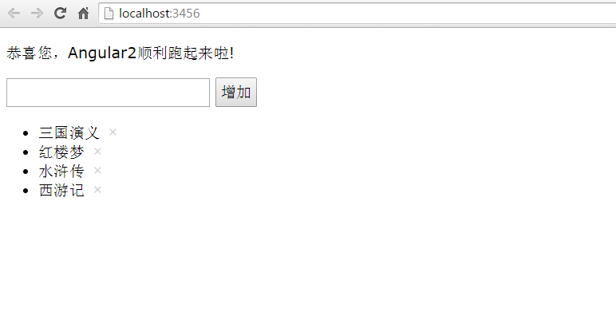

# angular2-seed
Angular2 seed project to help to run angular2 out of the box.

**Note**: I have switched [gulp](http://gulpjs.com/) to [webpack](https://webpack.github.io/) with [babel](https://babeljs.io/) now,  since the latter is more powerful and popular.

# How to start

- `cd resouces`

- run `npm install`

- run `npm run start`

- visit [http://localhost:3000](http://localhost:3000) to see the demo

# Demos

* [Basic](http://localhost:3000/index.html)
* [Form & Form validation](http://localhost:3000/form.html)
* [Router](http://localhost:3000/router.html)

